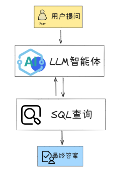
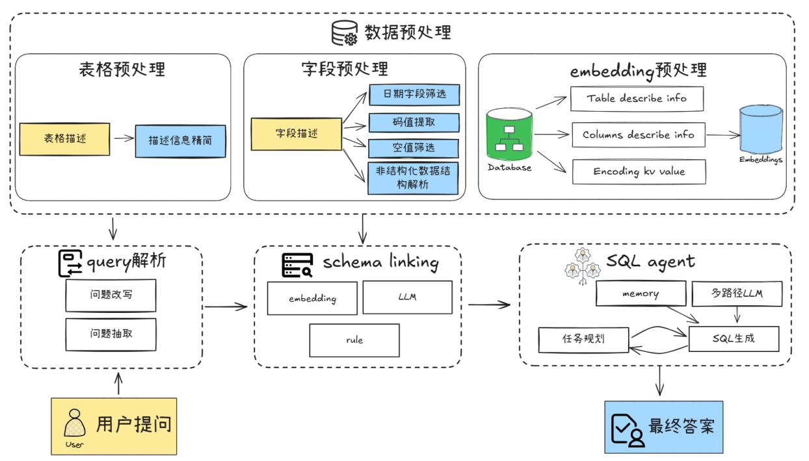
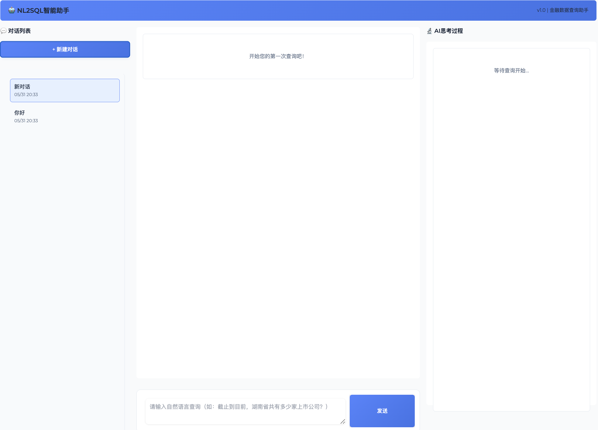

# 2024金融行业大模型挑战赛-人生海海团队方案

## 赛题内容

参赛选手需利用GLM-4模型API以及比赛提供的金融数据，开发一个能够处理多轮问答的系统，旨在回答用户提出的金融相关问题。

<div align="center">

</div>

本赛题涉及多轮问答，根据难度和复杂度，赛题分为初级、中级、高级三个等级，描述如下：

- **初级：数据基本查询（30分）**  
  通过SQL或API等方式可查询结果，如：「某公司（或某股票代码）2022年11月2日的涨跌幅为多少？」

- **中级：数据统计分析查询（40分）**  
  在初级阶段的基础上，使用基础数据完成金融数据的统计分析、关联指标查询、公式计算等，如：「MACD即将金叉，中小板，近半年涨停次数超过10次的股票有多少家？分别是谁？」

- **高级：复杂问题（30分）**  
  股价回测、财务分析等，如：「每年的4月叠加上市公司年报和一季报。理论上新闻频次会达到了一年最高。帮我验证下，2021年在A股有多少比例的上市公司符合这个假设?」


## 数据结构
- **结构化数据**：包括A股上市公司数据、股东及股权信息、财务报表、行业板块、股票市场数据、基金数据、港美股数据、指数数据、舆情数据等
- **非结构化数据**：包括年度报告、季度报告、各类公告、招股说明书等文档

🔗 详细数据格式内容，请跳转[赛题地址](https://competitions.zhipuai.cn/matchDetail?id=120241202000000003)


## 方案架构
结合schema多路召回和多agent协作，实现多数据库、多轮问答等复杂场景下的智能问数。
1. **Data Preprocess**: 描述信息精简、字段初筛、文本Embedding初始化
2. **Query Extractor**: 从问题中提取关键查询信息，问题改写
3. **Schema Linking**: 结合 embedding、LLM 及rule实现多路召回和排序
4. **SQL Agent**: 负责任务规划、行动与SQL生成及执行的智能体

<div align="center">

</div>

## Quick Start

### 环境配置
1. python环境
```bash
pip install -r requirements.txt
```

2. 配置环境变量：
```bash
# 编辑.env文件，填入必要的API密钥，Team Token，及LLM name等信息
cp env_template .env
```

### 运行系统

1. 修改配置文件 `src/config.py`：
```python
RUN_TIMES = 1 or 2  # 问题重复运行次数(运行2次准确率更高，但token消耗翻倍)
DEBUG = True   # 调试模式开关, 开启时只处理少量样本
LLM_ensemble = True  # LLM集成开关(SQL生成效果更好，token消耗高)
INPUT_FILE = "./data/questions/金融复赛a榜.json"  # 输入问题文件路径
OUTPUT_DIR = "./output/复赛A榜"  # 输出目录
DATA_PATH = "./data/interim"  # 中间数据存储路径
   ```

2. 数据预处理
* 见[`src/表格预处理.ipynb`](src/表格预处理.ipynb)，处理好的表格数据已放在[`./data/interim`](./data/interim)路径中

3. 运行主程序：
```bash
python src/run_main.py
```

## 方案介绍

### 1. Query Extraction

从自然语言问题中提取关键查询信息：

<div align="center">

</div>

### 2. Schema Linking
不同的表列召回方法优劣如下，系统采用多路召回集成的方式实现表格和列名召回：
| 方法 | 优点 | 缺点 | 效率 |
|------|------|------|------|
| LLM | 1. 能处理复杂逻辑<br>2. 适配多表关联复杂查询场景 | 1. 处理大量库表时性能下降<br>2. 有一定语义幻觉 | 低 |
| Embedding | 1. 可对表/列/码值多类信息召回<br>2. 可结合领域词库进行检索 | 1. 对上下文推理能力弱<br>2. 列名歧义时易误召回 | 中等 |
| Rule | 1. 简单查询效果稳定<br>2. 可根据业务快速增删规则 | 1. 无法处理复杂语义表达<br>2. 维护成本高 | 高 |

<div align="center">

</div>

### 3. SQL Agent执行

* **SQL生成**: 基于记忆、schema和错误信息生成SQL，支持迭代优化

* **任务规划**: 采用"观察-思考-行动"循环进行动态决策

* **记忆管理**: 维护历史查询和样例，通过问题骨架相似度召回进行few-shot检索

* **LLM决策**: 根据相似度启用多路径策略，通过Select LLM筛选最优方案


<div align="center">

</div>


## 界面效果演示

### 启动界面
```bash
python start_gradio.py
```

在浏览器中访问 `http://127.0.0.1:7860` 

<div align="center">

</div>

## ToDo

- [ ] 界面知识库及memory增量更新
- [ ] 添加问答用户反馈机制
- [ ] 完善运行错误处理与提示
- [ ] 支持不同行业的数据库拓展